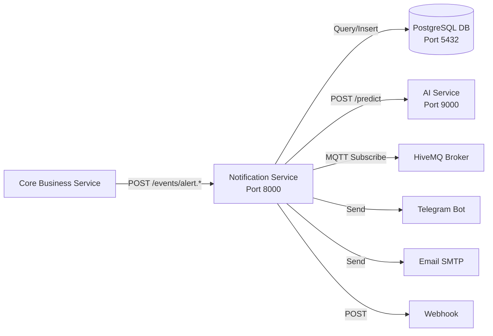

# 📋 Phân Tích Dự Án — Notification Service (team-notify)

## 1. Tổng Quan Dự Án

Đây là **Lab 05** của môn **FIT4110** — xây dựng hệ thống **Smart Campus Operations Platform** sử dụng Docker Compose để điều phối đa dịch vụ.

Bạn đảm nhận phần **Notification Service** (`team-notify`), là dịch vụ nhận event alert từ Core Business Service và gửi thông báo đa kênh.

---

## 2. Kiến Trúc Hệ Thống (3 Container)



| Container | Image | Port | Vai trò |
|-----------|-------|------|---------|
| `fit4110-api-lab05` | Build từ `Dockerfile` | 8000 | Notification Service API (FastAPI) |
| `fit4110-db-lab05` | `postgres:15-alpine` | 5432 | Lưu lịch sử notification delivery |
| `fit4110-ai-lab05` | Build từ `src/ai_service/Dockerfile` | 9000 | AI Service mock (`/predict`, `/health`) |

---

## 3. Nghiệp Vụ Notification Service (Phần Bạn Đảm Nhận)

### 3.1 Các API Endpoints

| Method | Endpoint | Auth | Chức năng |
|--------|----------|------|-----------|
| `GET` | `/` | ❌ | Dashboard HTML |
| `GET` | `/health` | ❌ | Health check (DB + AI) |
| `POST` | `/events/alert.created` | ✅ Bearer | Nhận event alert mới → dispatch notification |
| `POST` | `/events/alert.escalated` | ✅ Bearer | Nhận alert leo thang → dispatch CRITICAL |
| `POST` | `/events/alert.resolved` | ✅ Bearer | Nhận alert đã khắc phục → dispatch thông báo |
| `GET` | `/api/v1/notifications` | ✅ Bearer | Liệt kê lịch sử notification (max 50) |
| `GET` | `/notifications/{id}` | ✅ Bearer | Xem chi tiết trạng thái 1 notification |
| `POST` | `/api/v1/alerts` | ❌ | Nhận alert từ AI Vision service |

### 3.2 Luồng Xử Lý Chính

```
1. Nhận event (HTTP POST hoặc MQTT message)
    ↓
2. Deduplication check (bỏ qua alert trùng trong 5 phút)
    ↓
3. Xác định kênh gửi dựa theo severity:
   - LOW → chỉ ghi log
   - MEDIUM → email
   - HIGH → telegram + app
   - CRITICAL → telegram + email + app
    ↓
4. Tạo DispatchJob → đẩy vào queue
    ↓
5. Background worker lấy job → gửi notification
    ↓
6. Retry tối đa 3 lần nếu thất bại
    ↓
7. Cập nhật trạng thái vào DB (pending → sending → delivered/failed)
```

### 3.3 Các Kênh Gửi Thông Báo

| Kênh | Cấu hình cần thiết | Fallback |
|------|---------------------|----------|
| **Telegram** | `TELEGRAM_BOT_TOKEN`, `TELEGRAM_CHAT_ID` | Mock qua httpbin.org |
| **Email** | `SMTP_SERVER`, `SMTP_USER`, `SMTP_PASSWORD` | Mock qua httpbin.org |
| **Webhook/App** | `WEBHOOK_URL` | Bỏ qua nếu chưa cấu hình |

### 3.4 MQTT Integration

- Broker: HiveMQ Cloud (`f6f78e87db4a4c189dd3d706745a5e93.s1.eu.hivemq.cloud:8883`)
- Topic subscribe: `smart-campus/events/alert`
- Khi nhận message MQTT → parse JSON → `process_incoming_alert()` → dispatch

---

## 4. Cấu Trúc File Quan Trọng

```
lab-05-phamtrhieu-main/
├── docker-compose.yml          ← Định nghĩa 3 service + network + volume
├── Dockerfile                  ← Build image cho Notification Service
├── .env                        ← Biến môi trường (tokens, DB, MQTT...)
├── requirements.txt            ← Dependencies Python
├── src/
│   ├── notification_app/
│   │   ├── main.py             ← ★ CODE CHÍNH - toàn bộ logic service
│   │   └── templates/
│   │       └── dashboard.html  ← Giao diện web dashboard
│   └── ai_service/
│       ├── main.py             ← AI mock service
│       └── Dockerfile          ← Build AI service
├── contracts/
│   └── team-notify.openapi.yaml ← OpenAPI contract
├── checklists/
│   └── readiness-checklist.md
└── RUN_COMPOSE.md              ← Hướng dẫn chạy
```

---

## 5. Hướng Dẫn Chạy Dự Án

### Cách 1: Chạy bằng Docker Compose (Khuyến nghị - chạy đầy đủ 3 services)

> [!IMPORTANT]
> Cần cài **Docker Desktop** trước khi chạy.

```powershell
# Bước 1: Mở terminal tại thư mục dự án
cd C:\Users\userp\Downloads\lab-05-phamtrhieu-main

# Bước 2: Build và chạy toàn bộ stack
docker compose up -d --build

# Bước 3: Xem logs
docker compose logs -f

# Bước 4: Kiểm tra health
curl http://localhost:8000/health
curl http://localhost:9000/health

# Bước 5: Test gửi alert
curl -X POST http://localhost:8000/events/alert.created `
  -H "Authorization: Bearer local-dev-token" `
  -H "Content-Type: application/json" `
  -d '{\"eventId\": \"550e8400-e29b-41d4-a716-446655440000\", \"eventType\": \"alert.created\", \"alertId\": \"ALT-2026-TEST-001\", \"correlationId\": \"COR-001\", \"severity\": \"HIGH\", \"payload\": {\"title\": \"Test Alert\", \"message\": \"Phát hiện sự cố test\", \"source\": \"sensor-01\"}}'

# Dừng stack
docker compose down
```

### Cách 2: Chạy Local (không Docker, chỉ API service)

```powershell
# Bước 1: Tạo virtual environment
cd C:\Users\userp\Downloads\lab-05-phamtrhieu-main
python -m venv .venv

# Bước 2: Kích hoạt venv
.\.venv\Scripts\Activate.ps1

# Bước 3: Cài dependencies
pip install -r requirements.txt

# Bước 4: Chạy Notification Service
uvicorn notification_app.main:app --app-dir src --host 0.0.0.0 --port 8000 --reload

# Bước 5: Mở trình duyệt
# Dashboard: http://localhost:8000
# Health:    http://localhost:8000/health
# Docs:      http://localhost:8000/docs
```

> [!WARNING]
> Khi chạy local không có Docker, DB và AI Service sẽ không khả dụng → service tự fallback sang **in-memory storage** và log warning. Các chức năng chính vẫn hoạt động bình thường.

### Cách 3: Chạy bằng Makefile

```powershell
make compose-up     # Build & chạy stack
make compose-down   # Dừng stack
make logs           # Xem logs
```

---

## 6. Kiểm Tra & Test

### Health Check
```powershell
# API Service
curl http://localhost:8000/health

# AI Service  
curl http://localhost:9000/health

# Database
docker exec -it fit4110-db-lab05 pg_isready -U lab05
```

### Postman/Newman Test
```powershell
npm install
npm run test:compose
```

### Xem danh sách notifications đã gửi
```powershell
curl -H "Authorization: Bearer local-dev-token" http://localhost:8000/api/v1/notifications
```

---

## 7. Lưu Ý Quan Trọng

> [!CAUTION]
> File `.env` chứa tokens thật (Telegram Bot Token, MQTT credentials). **KHÔNG commit file `.env` lên Git**. File `.gitignore` đã được cấu hình để bỏ qua `.env`.

> [!NOTE]
> Code trong `main.py` có **import trùng lặp** (dòng 1-72 và dòng 73-175) — phần đầu tiên (dòng 1-72) là code cũ chưa được xóa. Code thực tế chạy từ dòng 73 trở đi do Python sẽ dùng các định nghĩa cuối cùng (overwrite). Tuy nhiên, có **2 hàm `log_notification_delivery` trùng** (dòng 420 và dòng 724) — hàm ở dòng 724 sẽ là hàm được sử dụng vì nó đã ghi đè hàm trước.
