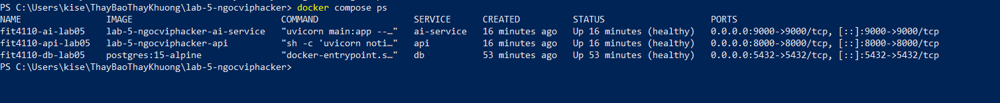
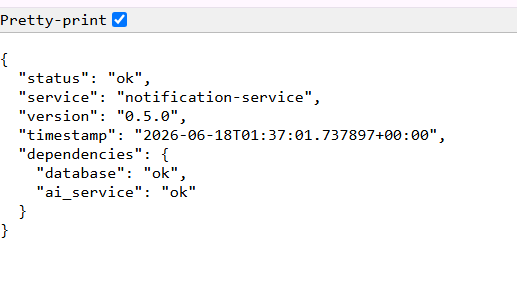
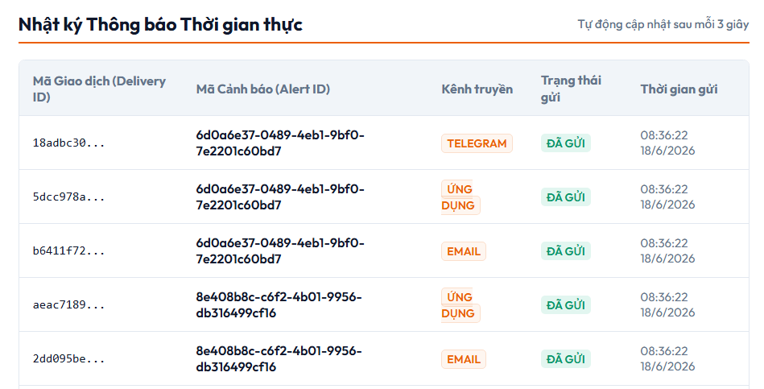

# BÁO CÁO THỰC HÀNH TÍCH HỢP DỊCH VỤ — BUỔI 6
## Nhóm A7: Notification Service (Product A)

Báo cáo này được cấu trúc theo đúng 6 bước hướng dẫn của giảng viên phục vụ cho việc đánh giá và chấm điểm tích hợp hệ thống Smart Campus.

---

### 1. Vai trò của nhóm trong hệ thống
* **Tên Dịch Vụ:** Notification Service (Dịch vụ gửi thông báo cảnh báo).
* **Vai trò nghiệp vụ:** Đảm nhận việc tiếp nhận các sự kiện cảnh báo từ lõi nghiệp vụ và thực hiện gửi thông báo đa kênh (Telegram, Email, Mobile App, SMS) tới người dùng.
* **Mối quan hệ kết nối:** Đóng vai trò là **Provider** (Dịch vụ cung cấp endpoint). Nhóm **A6 (Core Business)** đóng vai trò là **Consumer** (Bên tiêu thụ/chủ động gọi kết nối sang máy của nhóm em).

---

### 2. Dữ liệu đầu vào (Input)
* **Loại dữ liệu nhận vào:** Request body dạng JSON chứa thông tin chi tiết sự kiện cảnh báo.
* **Giao thức nhận:** Nhận qua **REST API** (HTTP POST).
* **Đường dẫn Endpoint tiếp nhận:**
  * `POST /events/alert.created` (Khi có cảnh báo mới).
  * `POST /events/alert.escalated` (Khi cảnh báo leo thang).
  * `POST /events/alert.resolved` (Khi cảnh báo được khắc phục).
* **Dữ liệu mẫu nhận từ nhóm A6:**
  ```json
  {
    "eventId": "333aee5c-4164-44d5-b3aa-6c60572ccb40",
    "eventType": "alert.created",
    "alertId": "677bc548-9efc-49d6-a96a-3abd8a2bdedd",
    "correlationId": "COR-2026-05-19-001",
    "source": "core-business-service",
    "severity": "HIGH",
    "alertVersion": 1,
    "payload": {
      "title": "Cảnh báo phát hiện xâm nhập",
      "message": "Phát hiện đối tượng di chuyển bất thường tại khu vực Cổng chính DNU"
    },
    "channels": ["telegram", "email", "app"]
  }
  ```

---

### 3. Xử lý nghiệp vụ (Business Logic)
Khi nhận được dữ liệu Input từ nhóm A6, dịch vụ thực hiện các bước xử lý sau:
1. **Xác thực bảo mật (Authentication):** Kiểm tra mã Bearer token ở header. Chỉ chấp nhận các cuộc gọi có header `Authorization: Bearer local-dev-token`.
2. **Kiểm tra tính hợp lệ (Validation):** Validate dữ liệu JSON đầu vào bám sát hợp đồng OpenAPI, bắt buộc kiểm tra `eventId` phải là định dạng **UUID** hợp lệ.
3. **Phân tích với AI (AI Integration):** Gọi API sang dịch vụ **AI Service** (`POST http://ai-service:9000/predict`) để phân tích phân loại cảnh báo.
4. **Phân phối đa kênh & Ghi nhật ký:** Lặp qua mảng các kênh yêu cầu (`channels`), với mỗi kênh, hệ thống sinh một mã giao dịch (`deliveryId`) và ghi nhận vào cơ sở dữ liệu **PostgreSQL** (bảng `notifications`).
5. **Cơ chế xử lý lỗi & dự phòng (Fault Tolerance):**
   * Đặt **Timeout = 2.0s** cho các kết nối liên kết để tránh tình trạng hệ thống bị treo vô hạn.
   * Nếu Database PostgreSQL gặp sự cố không thể truy cập, dịch vụ tự động chuyển hướng lưu trữ sang bộ nhớ đệm tạm thời (**In-memory fallback**) để API không bị crash và vẫn phản hồi thành công cho đối tác.

---

### 4. Dữ liệu đầu ra (Output)
* **Kết quả trả về:** Trả về HTTP Status Code **`202 Accepted`** để xác nhận sự kiện đã được tiếp nhận và xếp hàng xử lý thành công.
* **JSON Output mẫu:**
  ```json
  {
    "eventId": "333aee5c-4164-44d5-b3aa-6c60572ccb40",
    "status": "queued",
    "processedAt": "2026-06-18T01:23:38.778699+00:00"
  }
  ```

---

### 5. Dữ liệu đầu ra được gửi đi đâu (Next Destination)?
* Dịch vụ Notification Service đứng ở **vị trí cuối cùng (Terminal node)** của luồng nghiệp vụ trong Smart Campus (thực hiện nhiệm vụ gửi trực tiếp ra thiết bị người dùng cuối), do đó **không truyền tiếp dữ liệu sang dịch vụ nào khác**.

---

### 6. Minh chứng Demo thực tế (Evidence)

#### 6.1. Trạng thái các Container (`docker compose ps`)
* Hệ thống khởi động ổn định 3 container: API (`fit4110-api-lab05`), DB (`fit4110-db-lab05`), và AI Mock (`fit4110-ai-lab05`).
* *(Bạn hãy chụp ảnh kết quả chạy lệnh `docker compose ps` và dán vào đây)*
* 

#### 6.2. Kiểm tra sức khỏe hệ thống (`GET /health`)
* Trạng thái trả về `200 OK` hiển thị đầy đủ thông tin các dịch vụ kết nối liên quan đều khỏe mạnh.
* 

#### 6.3. Bắt tay tích hợp thành công qua Radmin VPN với nhóm A6
* Địa chỉ IP Radmin VPN máy demo của nhóm: **`26.95.36.20`**
* Sự kiện kiểm thử tích hợp thực tế nhận được từ nhóm A6 (Core Business):
  * **Event ID nhận được:** `333aee5c-4164-44d5-b3aa-6c60572ccb40`
  * **Trạng thái lưu trữ:** Đã lưu thành công **3 bản ghi** giao dịch gửi thông báo tương ứng cho các kênh `telegram`, `email`, và ứng dụng `app` vào bảng cơ sở dữ liệu PostgreSQL.
* Minh chứng hiển thị trực tiếp trên trang Web Dashboard:
* 
